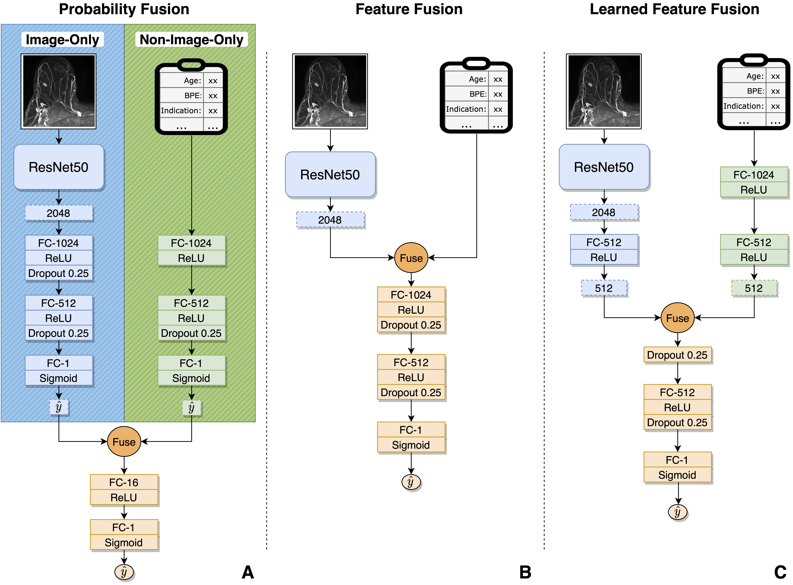

# breast_mri_fusion

Author: Greg Holste, Adam Alessio<br/>
Last Modified: 08/16/21

--------------

## Description

Code for [CVMAD 2021](https://sites.google.com/view/CVAMD2021/) paper, "End-to-End Learning of Fused Image and Non-Image Feature for Improved Breast Cancer Classification from MRI" by Gregory Holste, Savannah Partridge, Habib Rahbar, Debosmita Biswas, Christoph Lee, and Adam Alessio.

<!--  -->
<p align=center>
    
</p>

While clinicans integrate imaging findings with a variety of clinical data to make diagnostic decisions, deep-learned approaches to automatic diagnosis often only utilize imaging or only utilize clinical data. In this work, we explore methods to learn jointly from breast MRI imaging and associated non-image data in an end-to-end trainable manner. Our experiments evaluate fusion at various stages in the model (fusing intermediate learned features vs. probabilities) and with different fusion operations (concatenation vs. addition vs. multiplication). These approaches were validated on a dataset of over 15,000 dynamic contrast-enhanced MRI (DCE-MRI) iamges and associated non-image data (e.g., mammographic breast density and clinical indication) collected at the University of Washington to predict year-to-date breast cancer status. We found that all multimodal fusion approaches significantly outperformed unimodal baselines, and that fusion of intermediate learned features outperforms fusion of final probabilities.

## Usage

Assuming you have Anaconda installed, run `conda env create -f mri_fusion.yaml` to install all pre-requisites. The pipeline used for this work was simply to preprocess the data (`preprocess.py`) and train models (`train.py`); you can find the specific commands to conduct all experiments in `run_experiments.sh`. After training, we conducted a feature importance analysis (`feature_imp.py`) to understand which non-image features were most influential to breast cancer prediction. Lastly, scripts to produce figures and perform significance tests comparing models can be found in the `analysis/` directory. Results from the main experiments (the "best run" of the two unimodal baselines and the three main fusion models) can be found in the `results/` directory.

**To use this repository on your own multimodal binary classification dataset,** you must prepare the data in the following file structure:
```bash
├── <your_dataset>
│   ├── Train
│   │   ├── 1_x.npy
│   │   ├── 1_y.npy
│   │   ├── 1_meta.npy
│   │   ├── ...
│   ├── Val
│   │   ├── 1_x.npy
│   │   ├── 1_y.npy
│   │   ├── 1_meta.npy
│   │   ├── ...
│   ├── Test
│   │   ├── 1_x.npy
│   │   ├── 1_y.npy
│   │   ├── 1_meta.npy
│   │   ├── ...
```
where `*_x.npy` contains a preprocessed image of shape `(h, w, c)`, `*_y.npy` contains the associated target of shape `(1,)`, and `*_meta.npy` contains the associated non-image data of shape `(n_features,)`. (This repository could easily be adapted to perform multi-class classification by tweaking the output layers and activations of the architectures in `models.py`.)

Once this is complete, you can simply run `train.py` with the arguments of your choice; for example, if you wanted to train the Learned Feature Fusion model on your dataset with the settings used in the paper, you might run
```python
python train.py --data_dir <path_to_your_dataset> \
                --out_dir <path_to_results> \
                --model learned-feature-fusion \
                --fusion_mode concat \
                --n_TTA 5 \
                --augment \
                --use_class_weights \
                --label_smoothing 0.1
```

Alternatively, you could use your own data loader and directory structure and simply import the model of your choosing from `models.py` in a custom training script.
